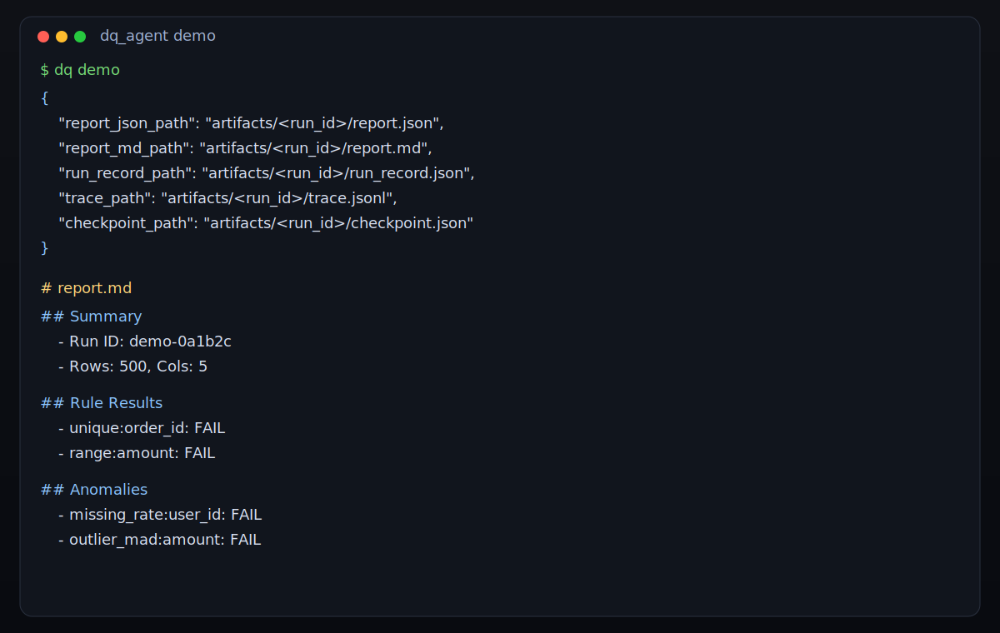

# dq_agent（中文说明）

[](https://github.com/Tylor-Tian/dq_agent/actions/workflows/ci.yml)


一个最小可复现的 **数据质量（Data Quality）+ 异常检测 CLI**，内置离线可运行的合成数据 Demo。

## 它是什么（What it is）

- 本地/离线可运行的数据质量 CLI，输入支持 CSV/Parquet，规则支持 YAML/JSON。
- 产出稳定的机器可读 `report.json` 与人可读 `report.md`。
- 适合作为 CI 中的数据质量 gate（可用退出码做阻断）。

## 它不是什么（What it isn't）

- 不是分布式计算引擎。
- 不是自动修复系统。
- 不是 LLM agent。

## 安装（Installation）

从 PyPI 安装：

```bash
pip install dq-agent
```

使用 `pipx` 安装（需要先发布到 PyPI）：

```bash
pipx install dq-agent
```

仓库开发模式安装：

```bash
pip install -e ".[test]"
```

## 快速开始（Demo）

要求：**Python 3.11+**

```bash
python -m venv .venv
source .venv/bin/activate
python -m pip install -U pip
pip install -e ".[test]"
```

运行内置 Demo：

```bash
python -m dq_agent demo
```

如果希望重复执行时产物路径稳定，可使用幂等键：

```bash
python -m dq_agent demo --idempotency-key demo-001 --idempotency-mode reuse
```

CLI 会输出类似如下 JSON：

```json
{"report_json_path": "artifacts/<run_id>/report.json", "report_md_path": "artifacts/<run_id>/report.md", "run_record_path": "artifacts/<run_id>/run_record.json", "trace_path": "artifacts/<run_id>/trace.jsonl", "checkpoint_path": "artifacts/<run_id>/checkpoint.json"}
```

## CI 集成（GitHub Actions）

你可以把 `dq run` 作为 CI 质量门禁：

```yaml
name: dq-gate
on: [push, pull_request]
jobs:
  dq:
    runs-on: ubuntu-latest
    steps:
      - uses: actions/checkout@v4
      - uses: actions/setup-python@v5
        with:
          python-version: "3.11"
      - name: Install
        run: |
          python -m pip install -U pip
          pip install dq-agent
          # 仓库内使用时可改为:
          # pip install -e ".[test]"
      - name: Run data quality gate
        run: |
          dq run --data path/to/data.parquet --config path/to/rules.yml --fail-on ERROR
```

退出码语义：

- `0`：运行成功且未触发 `--fail-on`
- `1`：I/O 或配置错误
- `2`：Guardrail/Schema/幂等冲突/回归失败，或触发 `--fail-on`

## 运行产物

每次运行会生成一个新目录：

- `artifacts/<run_id>/report.json`
- `artifacts/<run_id>/report.md`
- `artifacts/<run_id>/run_record.json`（可回放）
- `artifacts/<run_id>/trace.jsonl`（运行事件日志，NDJSON）
- `artifacts/<run_id>/checkpoint.json`（用于恢复）

示例产物（已提交到仓库，便于快速预览）：

- `examples/report.md`
- `examples/report.json`

## 在你自己的数据上运行

```bash
python -m dq_agent run --data path/to/table.parquet --config path/to/rules.yml
```

支持格式：

- 数据：CSV / Parquet
- 配置：YAML / JSON

可选 Guardrails（安全阈值）：

```bash
python -m dq_agent run \
  --data path/to/table.parquet \
  --config path/to/rules.yml \
  --max-input-mb 50 \
  --max-rows 500000 \
  --max-cols 200 \
  --max-rules 2000 \
  --max-anomalies 200 \
  --max-wall-time-s 30
```

当问题达到某个严重级别时直接失败：

```bash
python -m dq_agent run --data path/to/table.parquet --config path/to/rules.yml --fail-on ERROR
```

退出码语义：

- `0`：运行完成，且未触发 `--fail-on`
- `1`：I/O 或配置解析错误
- `2`：Guardrail、Schema 校验失败，或触发 `--fail-on`

## 幂等执行（Idempotency）

```bash
python -m dq_agent run \
  --data path/to/table.parquet \
  --config path/to/rules.yml \
  --idempotency-key run-001 \
  --idempotency-mode reuse
```

模式说明：

- `reuse`（默认）：若已有该 key 的 `report.json` + `run_record.json`，直接复用
- `overwrite`：重新执行并覆盖确定性路径下的产物
- `fail`：若产物已存在，返回 `idempotency_conflict` 并以退出码 2 结束

## Shadow 对比（基线 vs 候选）

同一份数据下比较两套配置：

```bash
python -m dq_agent shadow \
  --data path/to/table.parquet \
  --baseline-config path/to/baseline.yml \
  --candidate-config path/to/candidate.yml \
  --fail-on-regression
```

输出目录结构：

```text
artifacts/<shadow_run_id>/
  baseline/<baseline_run_id>/...
  candidate/<candidate_run_id>/...
  shadow_diff.json
```

## 回放与恢复

回放：

```bash
python -m dq_agent replay --run-record artifacts/<run_id>/run_record.json --strict
```

恢复（当部分产物丢失时自动补齐）：

```bash
python -m dq_agent resume --run-dir artifacts/<run_id>
```

## Schema 与校验

查看 JSON Schema：

```bash
python -m dq_agent schema --kind report
python -m dq_agent schema --kind run_record
python -m dq_agent schema --kind checkpoint
```

校验产物：

```bash
python -m dq_agent validate --kind report --path artifacts/<run_id>/report.json
python -m dq_agent validate --kind run_record --path artifacts/<run_id>/run_record.json
python -m dq_agent validate --kind checkpoint --path artifacts/<run_id>/checkpoint.json
```

## 配置示例（YAML）

`dq_agent/resources/demo_rules.yml` 提供了可直接运行的示例配置。

最小示例：

```yaml
version: 1
dataset:
  name: demo_orders
  primary_key: [order_id]
  time_column: created_at

columns:
  order_id:
    type: string
    required: true
    checks:
      - unique: true

  amount:
    type: float
    required: true
    checks:
      - range: { min: 0, max: 10000 }
```

## 内置检测能力

确定性规则：

- `not_null`
- `unique`
- `range`
- `allowed_values`
- `string_noise`（子串 / 正则模式）

统计异常：

- `outlier_mad`
- `missing_rate`

## 测试

```bash
pytest -q
```

## 项目结构（高层）

- `dq_agent/cli.py`：Typer CLI（`run` / `demo` / `shadow` / `replay` / `resume` 等）
- `dq_agent/loader.py`：CSV/Parquet 加载
- `dq_agent/config.py`：YAML/JSON 配置读取
- `dq_agent/contract.py`：配置契约校验
- `dq_agent/rules/`：确定性规则
- `dq_agent/anomalies/`：异常检测器
- `dq_agent/report/`：JSON + Markdown 报告输出
- `tests/`：单元与集成测试

## 真实数据集基准测试（Benchmarks）

项目在带有真实标签的数据集上评估 dq_agent 的错误检测能力，使用成对 `dirty.csv` / `clean.csv` 进行对比。

评估指标：

- **cell-level** Precision / Recall / F1（错误单元格检测）
- **row-level** Precision / Recall / F1（包含任意错误单元格的行检测）

复现实验（Raha）：

```bash
bash scripts/run_raha_and_save.sh
```

复现实验（PED）：

```bash
bash scripts/run_ped_and_save.sh
```

用于评估的主脚本：`scripts/eval_dirty_clean.py`（会基于数据 profile 自动生成规则配置）。

如需从 `benchmarks/` 结果自动刷新英文 README 的 benchmark 区块，可执行：

```bash
python scripts/update_readme_benchmarks.py
```

### 当前仓库中的结果摘要

#### Raha（7 个数据集；dirty vs clean profiles）

| profile | datasets | macro_cell_f1 | micro_cell_f1 | macro_row_f1 | micro_row_f1 | cell_tp/fp/fn | row_tp/fp/fn |
|---|---:|---:|---:|---:|---:|---:|---:|
| clean | 7 | 0.817778 | 0.841898 | 0.915870 | 0.925301 | (16662, 3720, 2538) | (12288, 724, 1260) |
| dirty | 7 | 0.405580 | 0.303776 | 0.593699 | 0.466883 | (4183, 3488, 15686) | (4395, 714, 9323) |

完整拆分结果：`benchmarks/raha_compare.md`。

#### Raha string-noise 消融（patterns: `*`, `''`）

| metric | base | union | Δ |
|---|---:|---:|---:|
| macro_cell_f1 | 0.760961 | 0.817760 | 0.056798 |
| micro_cell_f1 | 0.806936 | 0.841877 | 0.034940 |
| macro_row_f1  | 0.859008 | 0.915870 | 0.056862 |
| micro_row_f1  | 0.876437 | 0.925301 | 0.048864 |

单数据集增益最大的例子（来自已提交 compare 文件）：

| dataset | base cell_f1 | union cell_f1 | Δ | base row_f1 | union row_f1 | Δ |
|---|---:|---:|---:|---:|---:|---:|
| raha/tax | 0.319744 | 0.718032 | 0.398288 | 0.324004 | 0.722462 | 0.398457 |

完整拆分结果：`benchmarks/raha_noise_union/compare.md`。

#### PED（额外 dirty/clean 数据集）

| profile | datasets | macro_cell_f1 | micro_cell_f1 | macro_row_f1 | micro_row_f1 | cell_tp/fp/fn | row_tp/fp/fn |
|---|---:|---:|---:|---:|---:|---:|---:|
| clean | 14 | 0.846318 | 0.056526 | 0.857537 | 0.104772 | (40776, 917613, 443580) | (45356, 455137, 319955) |
| dirty | 14 | 0.200416 | 0.010962 | 0.212178 | 0.035870 | (7726, 917533, 476630) | (14983, 455111, 350328) |

完整拆分结果：`benchmarks/ped_compare.md`。

## 设计文档与许可证

- 发布与协作文档：`CHANGELOG.md`、`CONTRIBUTING.md`、`CODE_OF_CONDUCT.md`、`SECURITY.md`
- 发布流程说明：`docs/publishing.md`
- 设计文档：`A0_SPEC.md`
- License：Apache-2.0
